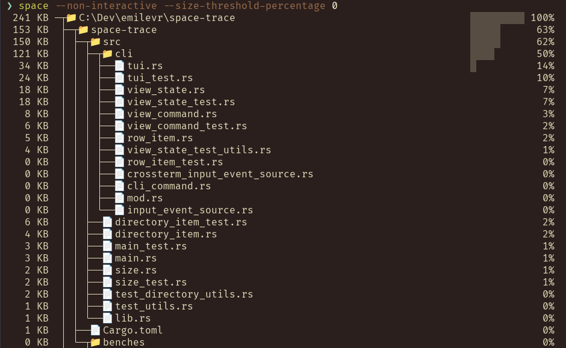

# Space

[](https://github.com/emilevr/space/actions/workflows/lint.yaml)
[](https://github.com/emilevr/space/actions/test.yaml)
[](https://crates.io/crates/space)
[](https://github.com/emilevr/space/actions/workflows/benchmark.yaml)
[](https://github.com/emilevr/space/actions/workflows/build-and-release.yaml)

A fast disk space analyzer and cleaner powered by Rust! :vulcan_salute:

## Description

`space` is a Command Line Interface (CLI) utility that can be used to visualize and manage disk space.

## CLI

Two operating modes are supported:

:one: **Text User Interface (TUI)**
  - Analyzes and displays the *apparent size* of files in one or more directory trees.
  - Enables visual exploration of disk space usage.
  - Files or directories may be deleted to free up disk space.
  - All files are included and may be visually filtered based on relative size.
  - This is the default mode.
    

:two: **Non-interactive, read-only output to the terminal**
  - Outputs one or more directory trees to the terminal and then exits.
  - Relative size filtering may be specified via command line parameters. The default is >= 1%. Use
    `space --help` to see options.
  - This mode is used when the *--non-interactive* argument is specified.
    

> :information_source: The *apparent size* of a file is the size of the file content, which is typically less
> than the actual space allocated as blocks on the disk. The larger the file, the less significant the
> difference.

### Limitations

- Hard links are considered real files and their sizes will be included.
- Symbolic links are listed but not followed.

### Installing the CLI

#### [Homebrew](https://brew.sh/) (Linux and MacOS)

```plaintext
brew install emilevr/space/space
```

In future, `space` may be upgraded via:

```plaintext
brew upgrade emilevr/space/space
```

#### [Scoop](https://scoop.sh/) (Windows)

```plaintext
scoop install space
```

In future, `space` may be upgraded via:

```plaintext
scoop update space
```

#### Bash

```
bash -c "$(curl -fsSL https://raw.githubusercontent.com/emilevr/space/main/install/install.sh)"
```

#### PowerShell

If you have PowerShell installed on either Windows, Linux or MacOS, you can run the following in a PowerShell terminal to install (or reinstall) the latest version of space:

```powershell
Set-ExecutionPolicy RemoteSigned -Scope CurrentUser # Optional if your current execution policy already allows local scripts
Invoke-WebRequest -UseBasicParsing https://raw.githubusercontent.com/emilevr/space/main/install/install.ps1 | Invoke-Expression
```

#### Direct Download

Download and extract the relevant file for your platform and operating system from the list of assets included in the [latest release](https://github.com/emilevr/space/releases)

### Notes

> **Yet another disk space usage utility?**
>
> You may have noticed that there are a fair number of disk space usage utilities out there, written in many
> languages. So why make another one? Well, this kind of project is a great way to learn a new language and a
> bunch of related stuff, like building and distributing applications for many platforms. It's also fun to write,
> with some challenges around performance that provides an opportunity to give Rust's "Fearless Concurrency" a
> spin. The implementation is straight forward and hasn't been optimized, yet it performs pretty well. Some
> future features will make much greater use of concurrency.
>
> :information_source: Optimization and benchmarks against similar tools are on the
> [backlog](https://github.com/users/emilevr/projects/1).
>
> **Thoughts on Rust so far**
>
> Given that this is my first Rust project, what are my thoughts on Rust so far? Well, it's great to work
> with a language that has no nulls, no exceptions, no garbage collection and the best tooling of any language I
> have come across so far.
>
> The current implementation of *space* is a little wasteful w.r.t. memory, which will be addressed with a
> little optimization when the time comes. That said, without a GC and a runtime that typically does work and
> allocations in the background, the memory and CPU usage is consistent and fairly low, considering the amount
> of data involved. For example:
>
> | Directory stats               | TUI Memory Usage |
> |-------------------------------|------------------|
> |   239 files,   66 directories |  ~2.8 MiB        |
> |  3937 files,  828 directories |  ~5.5 MiB        |
> | 55637 files, 6250 directories | ~37.8 MiB        |
>
> Also of note is that the CLI executable has no dependencies and is only ~1.4 MiB in size. Gotta ♥ Rust.
>
> **In conclusion**
>
> This has been such a good experience that I have decided to use Rust for all my future (suitable) side
> projects.

## Getting started with this repo

This repository contains:
- A CLI utility.
- A Rust library that can be used to analyze disk space. The library is not published to
  [crates.io](https://crates.io/), but may be at some point in the future.
- A CLI build tool that takes care of versioning, code coverage and benchmarks.

### Prerequisites

- The [Rust toolchain](https://www.rust-lang.org/tools/install) must be installed. See
  [rust-toolchain.toml](./rust-toolchain.toml) for the currently supported version.
- [Visual Studio Code](https://code.visualstudio.com/) is the recommended IDE. The recommended extensions are
  listed in the [.vscode/extensions.json](.vscode/extensions.json) file and Visual Studio Code should prompt
  for their installation automatically.

### Enabling Git hooks (once off)

After the initial checkout please run the post-checkout hook manually via:
```bash
git config core.hooksPath ./.git-hooks
# On MacOS / Linux, make the hook scripts executable. On Windows, comment out the line below:
chmod +x .git-hooks/*
git hook run post-checkout
```

This will setup the hooks directory, enabling the pre-commit hook to run linting, code coverage and benchmarks.

### Building and running the space CLI

To build the library and binaries, simply run `cargo build --all-features` from the repo root directory.
The binaries will be built in the `./target/debug` directory. Alternatively use `cargo run --bin space` to
build and run the `space` CLI.

> :information_source: All the commands listed below should also be run from the repo root.

### Running Tests

- Run non-interactive tests via `cargo test --all-features`.
- Run all tests, including interactive. ones via `cargo test --all-features -- --include-ignored`. Note:this
  requires a large/maximized terminal window.

### Running code format and lint tests

- Run `cargo fmt -- --check` to check code formatting.
- Clippy comes to the rescue for linting, via `cargo clippy`.

### Debugging

- Debugging profiles for Visual Studio Code have been created in the `.vscode` directory.
- Tests can be easily run or debugged by using the *Run Test* or *Debug* links above each test in the IDE:
  

### Code Coverage

This repo contains a simple Rust build project that takes care of versioning, running code coverage and
benchmark tasks.

In order for code coverage to be generated, ensure you have installed *llvm-tools* via
`rustup component add llvm-tools`.

To generate a code coverage report, run `cargo install --path ./buildit && buildit coverage --include-ignored`.

### Benchmarks

To run a benchmark test, use `cargo buildit benchmark`.

> :information_source: The plan is to make this a comparative benchmark that runs as part of each PR merge
> build, with the results automatically published to the README.

## Contributing

Please read [CONTRIBUTING.md](./CONTRIBUTING.md) for details on the code of conduct and how to submit pull
requests.

## Versioning

[SemVer](http://semver.org/) is used for versioning. For the versions available, see the
[tags](https://github.com/emilevr/space/tags) on this repository.

## Authors

- Emile van Reenen - initial work - [emilevr](https://github.com/emilevr)

Also see the list of [contributors](https://github.com/emilevr/space/contributors) to this project.

## License

This project is licensed under the MIT License - see the [LICENSE](./LICENSE) file for details

## Acknowledgments

- Thanks to all the Rust library contributors out there, especially for those libs used by this project. Keep
  up the great work! See the relevant [Cargo.toml](./Cargo.toml) file dependencies.
- Thanks to the many disk space usage tool authors out there, written in Rust and other languages.
  Challenge accepted! :relaxed: The future benchmark section will acknowledge a few of these.
- Thanks to [PurpleBooth](https://gist.github.com/PurpleBooth) for some
  [great repo templates](https://gist.github.com/PurpleBooth/109311bb0361f32d87a2).
